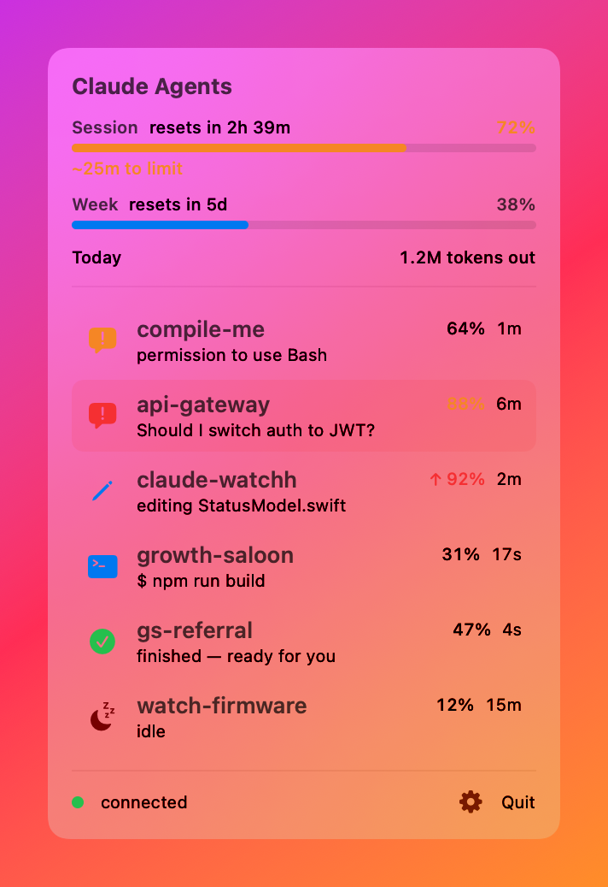
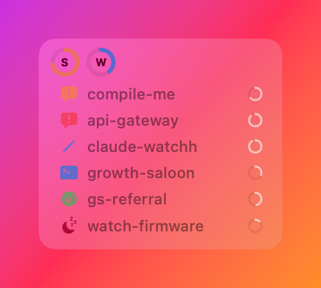

# Claude Agents — menu bar app + desktop widget

A native macOS menu bar app (and a floating desktop widget) that shows every
**Claude Code** agent running across all your projects at a glance — what each
one is doing, which need your input, and how close you are to your usage limits.



## What it does

- **Live dashboard** — one row per agent: a tool-aware icon (terminal, pencil, magnifier…), the project, what it's doing right now (`editing main.cpp`, `$ npm run build`), and how long.
- **Knows what it's waiting on** — a blocked agent shows the actual question / permission it's asking, not just "needs input".
- **Menu-bar badge** — the bar icon shows the count of agents waiting on you.
- **Notifications** — a banner + sound the moment an agent needs input or finishes. Suppressed for the terminal you're actively looking at; only background agents ping you. Clicking a banner jumps to that agent's terminal (with [`terminal-notifier`](https://github.com/julienXX/terminal-notifier) installed).
- **Token / quota usage** — session (5-hour) and weekly limit gauges with reset countdowns and a burn-rate ETA, plus a per-chat context-fill %, a "today" token total, and alerts before you hit a wall.
- **Stuck detection** — an agent waiting on you 5+ minutes turns red.
- **Click to focus** — click a row to jump to that agent's terminal tab (iTerm/Terminal by tty; VS Code window by folder).
- **Floating desktop widget** — pop the panel out into a draggable, always-on-top, translucent HUD.



## How it works

```
Claude Code hooks   ──POST /event──►  ┐
status line script  ──POST /usage──►  ├─ local daemon (127.0.0.1:7459) ──GET /status──► menu bar app
                                       ┘   (aggregates session state + usage; stdlib only)
```

Everything is local — no network calls, no account credentials. The daemon reads
only what Claude Code already exposes (hook events, the status-line JSON, and
session transcripts for the daily token total).

## Setup

Requires macOS 14+ and `python3`.

1. **Daemon** — `cd daemon && python3 claude_watch_daemon.py` (stdlib only, no deps). Optionally `bash daemon/install-launchd.sh` to run it at login and restart on crash.
2. **Hooks** — `bash hooks/install.sh` merges the Claude Code hooks (and the status-line usage reporter) into `~/.claude/settings.json`. Restart your Claude Code sessions afterward.
3. **App** — `cd macapp && ./build.sh && open ClaudeWatchBar.app`. The build script compiles with SwiftPM and assembles a menu-bar-only (`LSUIElement`) `.app` — no Xcode GUI needed.
4. *(optional)* `brew install terminal-notifier` for clickable notifications; the Settings gear has a launch-at-login toggle.

First click-to-focus prompts once for Automation permission; active-terminal suppression prompts once for Accessibility. Both fail safe if not granted.

## Layout

- `macapp/` — the SwiftUI menu bar app + floating widget (`ClaudeWatchKit` library + `ClaudeWatchBar` executable).
- `daemon/` — the localhost HTTP daemon, aggregator, and usage scan (pure Python stdlib).
- `hooks/` — the Claude Code hook reporter (`emit_event.py`), status-line usage snippet, and installer.

## License

MIT — see [LICENSE](LICENSE).
